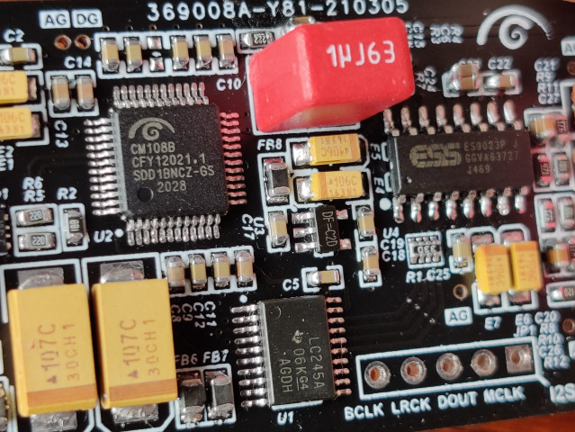
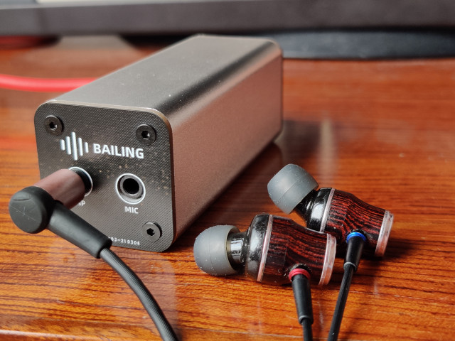

# BAILING USB声卡
[开发笔记](开发笔记.md)

* usb 2.0 5V/500mA传输供电
* 支持16bit 44.1k/48k 音频编解码
* CTIA标准3.5mm麦克风输入
* 142mW@16Ω 耳机驱动能力
* 内置ES9023 DAC + TPA6133A2 耳机放大器

## 成品展示

https://www.bilibili.com/video/BV1vy4y147vE

